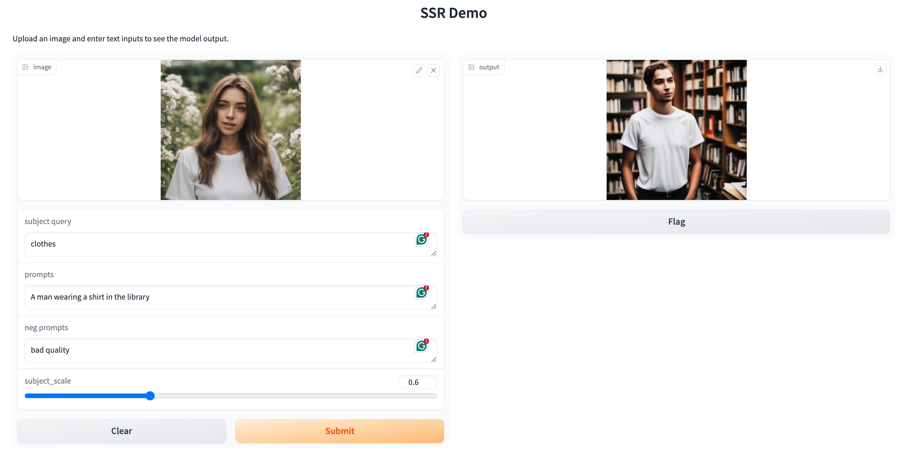
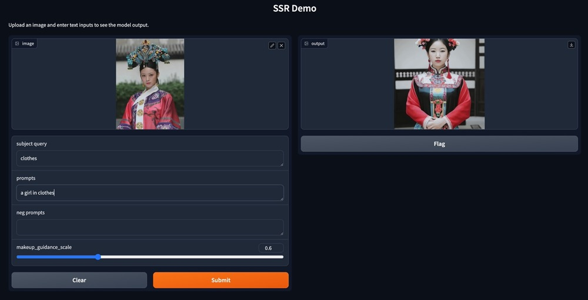

# SSR-Encoder: Encoding Selective Subject Representation for Subject-Driven Generation

<a href="https://arxiv.org/pdf/2312.16272.pdf"></a>

Our SSR-Encoder is a model generalizable encoder, which is able to guide any customized diffusion models for single subject-driven image generation (top branch) or multiple subject-driven image generation from different images (middle branch) based on the image representation selected by the text query or mask query without any additional test-time finetuning. Furthermore, our SSR-Encoder can also be applied for the controllable generation with additional control (bottom branch).
## Method Details

Given a query text-image pairs, the SSR-Encoder employs a token-to-patch aligner to highlight the selective regions in the reference image by the query. It extracts more fine-grained details of the subject through the detail-preserving subject encoder, projecting multi-scale visual embeddings via the token-to-patch aligner. Then, we adopt subject-conditioned generation to generate specific subjects with high fidelity and creative editability. During training, we adopt reconstruction loss and embedding consistency regularization loss for selective subject-driven learning.

## Todo List
1. - [x] inference and training code
2. - [x] pre-trained weights

## Getting Started
### Environment Setup
Our code is built on the [diffusers](https://github.com/huggingface/diffusers/) version of Stable Diffusion, In our experiments, we use model version v1-5. If you have a diffusers version of [controlnet](https://huggingface.co/docs/diffusers/using-diffusers/controlnet) and [animatediff](https://github.com/guoyww/AnimateDiff) configured, you can use this repository directly.
```shell
git clone https://github.com/Xiaojiu-z/SSR_Encoder.git
cd SSR_Encoder
```
### Pretrained Models
We recognize the importance of data distribution in learning selective representations during training. To further optimize the model, we balanced and filtered the training data distribution based on different categories such as humans, dogs, cats and so on. After filtering and balancing, we obtained a smaller dataset of 2 million and finetune the original model. This resulted in better selectivety. We provide this checkpoints in [Google Drive](https://drive.google.com/drive/folders/1pMwzGRA8QzHjEH5Hc4zDwdsSDwjwQKMW?usp=sharing). The image encoder we use is [`openai/clip-vit-large-patch14`](https://huggingface.co/openai/clip-vit-large-patch14). Download them and save to the directory `models/ssr_model` and `models/image_encoder`. 

### Inference
We offer scripts for inference, including text/mask query t2i, combine controlnet, combine animatediff, multiple images and subjects combination.
```python
python infer_*.py
```

### Training
The best practice for maintaining selectivity: training from scratch requires a high demand for data distribution, so it is recommended to use our provided pre-trained models and fine-tune them on your own dataset.
```python
bash train.sh
```

### Gradio demo
We provide a simple gr demo for more flexible use.
```python
python gradio_demo.py
```



### Limitations
When using, we found that our method requires a balance between selectivity and subject alignment. Due to the distribution of the training data and the highly semantic representation of the CLIP features, our results are poor in some scenarios that require high attention to detail. We plan to improve it in the future.

For example：


## Citation
```
@misc{zhang2024ssrencoder,
      title={SSR-Encoder: Encoding Selective Subject Representation for Subject-Driven Generation}, 
      author={Yuxuan Zhang and Yiren Song and Jiaming Liu and Rui Wang and Jinpeng Yu and Hao Tang and Huaxia Li and Xu Tang and Yao Hu and Han Pan and Zhongliang Jing},
      year={2024},
      eprint={2312.16272},
      archivePrefix={arXiv},
      primaryClass={cs.CV}
}
```
